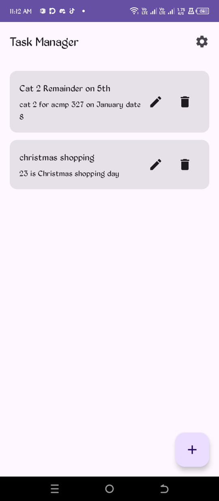
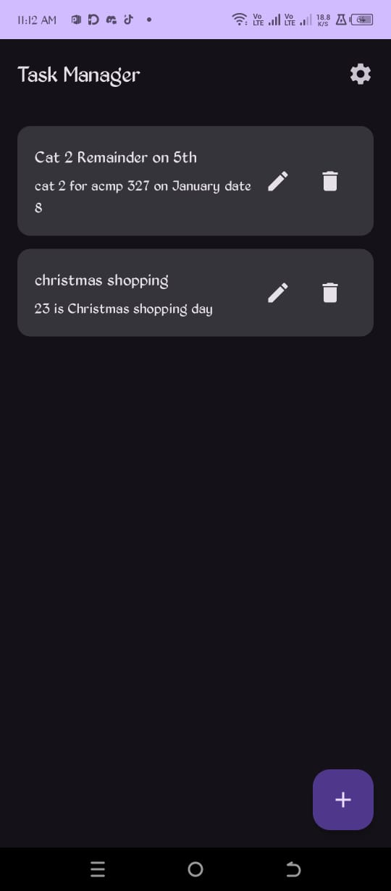
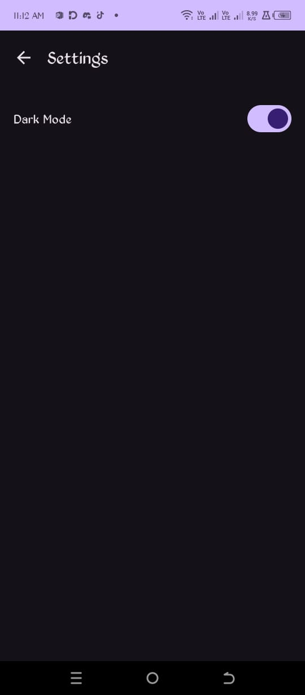
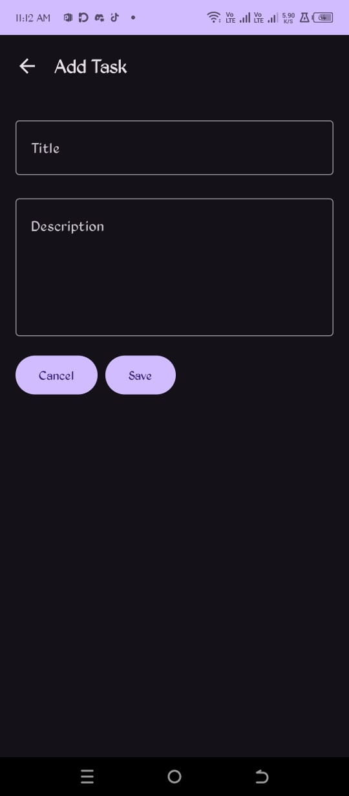

# TaskManagerApp

A simple task manager application for Android.

## Features

*   Add new tasks
*   View a list of existing tasks
*   Delete tasks by swiping or using the delete button
*   Modify tasks
*   Dark mode support

## Screenshots

| Light Mode                                                                       | Dark Mode                                                                        |
| -------------------------------------------------------------------------------- | -------------------------------------------------------------------------------- |
|             |               |
|                         |                           |
|                                                                                  |                      |

## Getting Started

To get a local copy up and running, follow these simple steps.

### Prerequisites

*   Android Studio
*   Git

### Installation

1.  Clone the repo
    ```sh
    git clone https://github.com/your_username/TaskManagerApp.git
    ```
2.  Open the project in Android Studio.
3.  Let Android Studio handle the Gradle sync.
4.  Run the app on an emulator or a physical device.

## Built With

*   [Kotlin](https://kotlinlang.org/)
*   [Android Jetpack](https://developer.android.com/jetpack)
*   [Gradle](https://gradle.org/)

## Build Issue Note
During development, a persistent build issue was encountered when trying to use experimental Compose APIs like `animateItemPlacement` and `SwipeToDismiss`. The build would fail with unresolved reference errors, even with the correct dependencies and annotations. The issue was resolved by removing these features. The current version of the app does not include these features, but the code for them is available in the commit history. It is recommended to investigate the project's dependencies and setup, specifically the Compose Material 3 dependency, to resolve this issue.

## License

Distributed under the MIT License. See `LICENSE` for more information.
